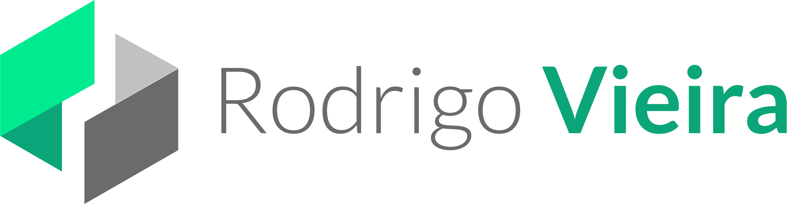

  

# Portfolio Rodrigo Vieira 🚀

Olá Bem-vindo ao meu portfólio! 

Este app foi desenvolvido com a framework Angular na versão 16, lib RxJS para lidar com os observables, SCSS, deploy com github actions, etc.

O site está online na seguinte url: ``https://rodrigovieira.vercel.app/``
